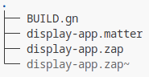

# Room Occupancy Displays using the Matter IoT protocol

This project is about implementing Room Occupancy Displays using a
Nordic microcontroller, the nRF5340DK and a Waveshare 7.5-inch 800x480
E-Ink display. The displays should support Matter over Thread and
therefore receive their update information via Matter commands.  
The server sending the Matter messages and managing devices is included
as well.

The whole system consists of a server application that functions as a
Matter controller, a Thread Border Router and the Occupancy Displays.  
The server obtains information from a local JSON file, extracts
information for each display and sends a Matter over Thread message to
each display.  
The Thread Border Router transmits the message into the wireless Thread
network and delivers it to the Occupancy Displays.  
The displays acknowledge the receipt of the information and update the
E-Ink accordingly.

# Building Process

These instructions are based on a fresh 64-bit installation of Kubuntu
23.10 with Linux Kernel 6.5.0-14. The build system was achieved on
several Linux and Mac OS systems but is theoretically also possible on
windows. It would be easier to use an operating system that still as
Python 3.8, but such an outdated system should not be used. Instead, the
build system will be adapted to work with Python 3.11. Unfortunately,
with every different system, new problems occur when building the
project or setting up the build system, so results may vary.

Approximately 60 GB will be necessary including the operating system.  
Follow the instructions in the given order.

## Hardware

1.  Nordic nRF5340DK -
    <https://www.nordicsemi.com/Products/Development-hardware/nrf5340-dk>

2.  Waveshare 7.5 inch E-paper -
    <https://www.waveshare.com/7.5inch-e-paper-hat.htm>

3.  Computer with Bluetooth Low Energy

4.  Thread Border Router - e.g. Apples’ HomePod mini or the Apple TV 4K,
    Google Nest Wifi Pro  
    The Raspberry Pi with OpenThread Border Router configuration and a
    nRF52840 Dongle was my choice.

## Wiring

The GPIOs on the nRF5340 DK must be connected to the Waveshare E-Ink
display.  
The PIN connections are the following:  
BUSY - P1.08, RST - P1.10, DC - P1.11. CS - P1.12, CLK - P1.15, DIN -
P1.14, GND - GND, VCC - VDD

## Dependencies

### Aptitude

1.  sudo apt install git ipset cmake bind9 python3.11-venv
    python3.11-pip

### Nordic Semiconductor Tools

1.  Download nRF Command Line Tools .deb from
    https://www.nordicsemi.com/Products/Development-tools/nRF-Command-Line-Tools/Download?lang=en#infotabs
    and install it.

2.  Download nRF Connect for Desktop .appimage from
    <https://www.nordicsemi.com/Products/Development-tools/nRF-Connect-for-Desktop/Download#infotabs>
    and make it executable.

3.  Open nRF Connect for Desktop and install the Toolchain Manager.

4.  Open the Toolchain Manager and install the nRF Connect SDK v2.5.0.

5.  Download the “J-Link Software and Documentation pack” .deb from
    https://www.segger.com/downloads/jlink/ and install it.

6.  Download the nrf-udev .deb from
    https://github.com/NordicSemiconductor/nrf-udev/releases and install
    it.

### PIP

If pip throws errors at some point, run the first line again.

1.  pip install pip==22.3.1 --break-system-packages

2.  pip install --user west

3.  pip install --upgrade cmake

4.  pip install stringcase wget ninja lark jinja2

5.  pip install markdown-it-py==2.1.0

### Other

1.  Download
    <https://chrome-infra-packages.appspot.com/dl/gn/gn/linux-amd64/+/latest>,
    extract gn executable to \~/deps and make it executable.

2.  Download
    https://github.com/project-chip/zap/releases/download/v2023.10.09-nightly/zap-linux-x64.zip
    and extract it to \~/zap-linux .

3.  Add \~/deps and \~/zap-linux to PATH:

sudo nano .bashrc

Add as a last line: export PATH="\~/zap-linux:\~/deps:$PATH"

4.  Add \~/ncs/v2.5.0/zephyr/ as env variable ZEPHYR_BASE:  
    sudo nano .bashrc  
    Add as a last line: export ZEPHYR_BASE= "\~/ncs/v2.5.0/zephyr/"

5.  Add $HOME/zap-linux as env variable ZAP_INSTALL_PATH:

sudo nano .bashrc

add as a last line:

export ZAP_INSTALL_PATH="$HOME/zap-linux"

6.  Reboot

### Zephyr

1.  wget
    <https://github.com/zephyrproject-rtos/sdk-ng/releases/download/v0.16.3/zephyr-sdk-0.16.3_linux-x86_64.tar.xz>

2.  tar xvf zephyr-sdk-0.16.3_linux-x86_64.tar.xz

3.  cd zephyr-sdk-0.16.3

4.  ./setup.sh  
    -\> “y” for installing host tools and registering

### Repositories

1.  Clone the CHIP / Matter repository into \~/  
    git clone <https://github.com/project-chip/connectedhomeip>

2.  cd connectedhomeip

3.  git checkout 8363494ab658bdcdf652817c0657a9e71c3d7249

4.  git submodule update --init

5.  source scripts/bootstrap.sh

6.  source scripts/activate.sh

7.  cd examples

8.  git clone <https://github.com/marviwolf/OccupancyDisplay>

### File Manipulations

1.  Navigate to
    \~/ncs/toolchains/*THEONLYFOLDEREXISTING_FUNNYNUMBERS*/usr/local/bin

2.  rm python3

3.  rm python3-config

4.  ln -s /usr/bin/python3 python3

5.  ln -s /usr/bin/python3-config python3-config

6.  nano ninja

change first line from python3.8 to python3.11

7.  cd \~/connectedhomeip/build/config/compiler

8.  nano BUILD.gn  
    add "-Wno-conversion" to the config(“disabled_warnings”) -\> cflags
    list in line 195  
    so it looks like this afterwards:  
      
    *config("disabled_warnings") { cflags = \[
    "-Wno-deprecated-declarations", "-Wno-missing-field-initializers",
    "-Wno-unknown-warning-option", "-Wno-unused-parameter",
    "-Wno-conversion", \]*

## Building and Flashing the nRF5340 Microcontroller software

1.  cd \~/connectedhomeip/examples/occupancydisplay

2.  Build the software:  
    ./build.sh

3.  Flash the nRF5340DK:  
    ./flash.sh

## Building and using the Matter Controller

### Build

1.  cd \~/connectedhomeip/examples/occupancydisplay/controller

2.  g++ controller.cpp -o controller

### Use

Always make sure that the “prod-data.json” contains the Dataset Key of
the Thread network!  
It’s a hexadecimal number looking like this:  
“0e080000000000010000000300000f35060004001fffe00208dbb0542829b36d160708fd1dea18f326836d05105da64f12cacf5d14f1e752e761f60ae4030f4fr9ms6e5468726561642d3362633401023bc40410d819c1e7ee0e5fb1bdd5cf99530ec6100c0402a0f7f8”.

1.  Pairing / Commissioning:  
      
    ./controller pair *nodeid pincode discriminator  
      
    **nodeid ==* the nodeid, the new device should have  
    *pincode ==* Matter PIN Code (always 20202021)  
    *discriminator ==* Matter discriminator to identify the device  
    - can be configured in
    occupancydisplay/nrfconnect/main/include/CHIPProjectConfig.h  
      
    Make sure that the occupancy display is in commissioning mode!  
    -\> Press button 4 (the downright one on the nRF5340DK)  
    The “prod-data.json” must contain the dataset key of the Tread
    network!

2.  Unpairing / Uncommissioning  
      
    ./controller unpair *nodeid  
      
    nodeid ==* the nodeid of the device to be deleted  
      
    The “prod-data.json” must contain the dataset key of the Tread
    network!

3.  15 Minute Intervall Update Mode  
      
    ./controller  
      
    Nodes must already be commissioned into the Matter network. The
    controller reads the contents of “prod-data.json” every 15 minutes
    and updates every mentioned node / occupancy display accordingly.
    The file can be altered in between. The JSON has to conform to the
    JSON Schema “schema.json”, that looks like this:  
      
    Every room represents one occupancy display node that should be
    updated.

# Directory Structure

The OccupancyDisplay project is structured into three main directories.

The “controller” directory contains everything for the server
application controlling the displays.  

**chip-config**: Persistent storage for the CHIP-tool Matter
controllers’ configuration. It includes information about the
commissioned devices, their keys, certificates, and status information.

**chip-tool-release**: Matter controller binary. Used as an interface to
communicate with the Matter devices. The binary can possibly be replaced
by new versions obtainable from the developers sdk-connectedhomeip
GitHub \[36\].

**controller.cpp**: Source code for the server application.

**controller**: Compiled server application binary.

**devices.json**: The servers’ internal device management. Object
entries could look like
“"1":{"discriminator":"1860","pincode":"20202021"}”. Every entry
represents a device in the Matter fabric.

**prod-data.json**: JSON containing the information that will be
displayed on the screens and the dataset key to commission devices into
the Thread network. Content structured according to “schema.json”.

**json**: Dependencies - JSON frameworks.

**schema.json**: JSON schema validating the content of “prod-data.json”.

The “display-common” directory contains the files generated by the ZAP
Tool, that define endpoints, clusters, commands, attributes, and other
entities of the Matter device.  
  
The files basically define what kind of Matter device is created. They
are used to generate C / C++ code included in the project.  
The
Endpoint 1 includes the Channel cluster, through which the command
“ChangeChannel” provides the base functionality of the project. Endpoint
0 is the Matter Root Node, that is mandatory to identify a Matter device
\[8\] S. 58.

The ”nrfconnect” directory contains the occupancy display software for
the nRF5340DK.  

**board_overrides.overlay**: Adds an identifier label to the waveshare
device layout.

**boards**: Layout (extensions) of the Nordic DK programmed.

**configuration**: Layout of the memory addresses for the Nordic DK.

**display.conf**: Configuration of the LVGL options e.g. enabling fonts.

**Kconfig**: Zephyr configuration definitions \[37\].

**third_party**: Linked to Matter GitHub project root directory. Used to
access dependencies.

**main**:

-   **AppTask.cpp**: Initializes the device and the Matter stack,
    network connection, LEDs, event handlers and more. It basically sets
    up the whole Matter functionality.

-   **main.cpp**: The entry point into the code. It does only start
    AppTask.cpp.

-   **ZclCallbacks.cpp**: Contains the functions that are called, when
    certain cluster states change.

-   **cluster/channel**: The Channel cluster (ID 0x0504) implementation.
    The inherent commands in use are "ChangeChannel" with ID 0x00 and
    "ChangeChannelResponse" with ID 0x01. The cluster attribute
    "CurrentChannel" with ID 0x0002 gets updated by the commands.  
    The ChannelManager.cpp is involved, when a “ChangeChannel” command
    reaches the Matter device. It then informs the display updater when
    new information was received.

-   **display**:

    -   display.c: Does most computing. It updates the E-Ink display as
        described in previous chapters.

    -   images.h: Contains images (e.g. the universities’ logo) as
        bitmaps.

-   **include**: App specific data definitions through .h files. For
    example, the CHIPProjectConfig.h defines the discriminator used as a
    commissioning identifier in the BLE advertising state.

-   **CMakeLists.txt**: The Cmake build configuration.

-   **prj.conf**: Specifies Kconfig values specific to this project,
    like e.g. product identifier, C++ version, commissioning autostart,
    bluetooth device name, reset on system error and sleepy end device
    configuration
